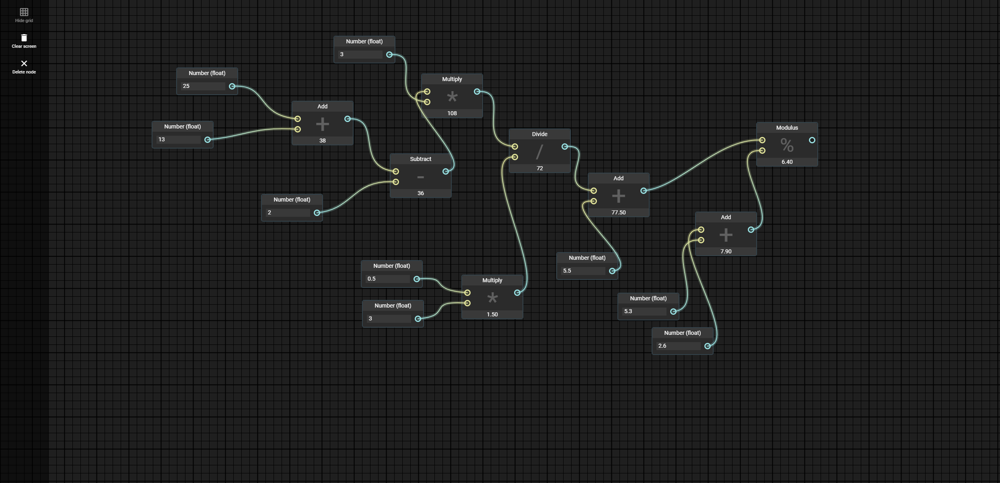

##### April 2, 2020

# Node editor

Built a basic web-based [node editor](https://jthissen.github.io/Node-editor/) while learning TypeScript/Angular. Double click anywhere on your screen to open to node-creation-menu.

## GIF

## Screenshots

